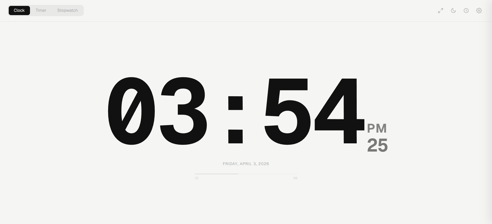
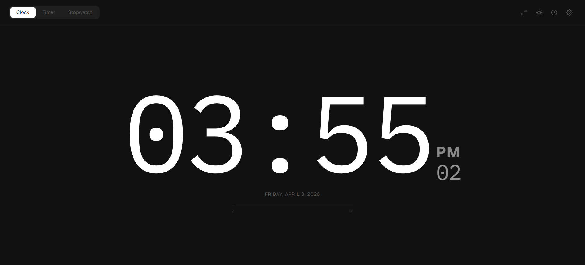
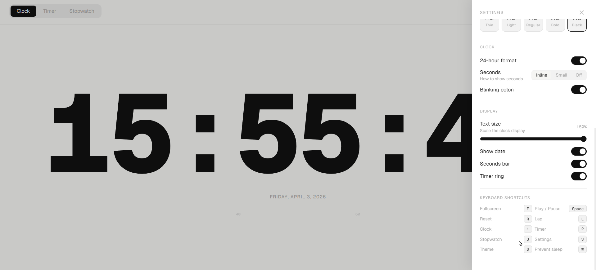

# dailyclock

A minimal clock. No installs, no dependencies. Just open it in your browser. Kasi wla akong relo

**[→ Site](https://viviengarcia.github.io/dailyclock)**

---

## Screenshots

---

## Keyboard Shortcuts

| Key | Action |
|-----|--------|
| `1` | Clock |
| `2` | Timer |
| `3` | Stopwatch |
| `Space` | Play / Pause |
| `R` | Reset |
| `L` | Lap |
| `F` | Fullscreen |
| `D` | Toggle theme |
| `W` | Prevent sleep |
| `S` | Settings |
| `Esc` | Close settings |

---

Made by [VivieneGarcia](https://github.com/VivieneGarcia) and ty claude lol
